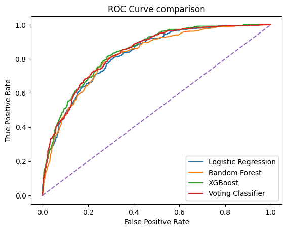
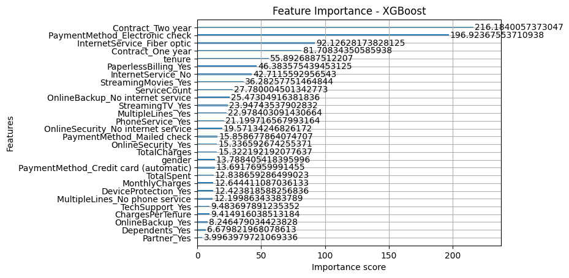

# Customer Churn Prediction

[](LICENSE)

## Project Overview
This project predicts customer churn for a telecommunications company using machine learning models. The goal is to identify customers likely to quit the service and provide insights that help in making strategies to hold customers.

---

## Dataset
- **Source:** Telco Customer Churn dataset  
- **Description:** Comprises information about customer demographics, account details, and usage patterns.  
- **Preprocessing:**  
  - Handled missing values  
  - Converted categorical variables to numerical  
  - Scaled numerical features  

---

## Methodology
1. **Data Analysis :** The dataset is analyzed to identify key features.  
2. **Feature Engineering:** New features like `TotalSpent`, `ServiceCount`, and `ChargesPerTenure` are created.
3. **Model Training:** Trained multiple models:
   - Logistic Regression
   - Random Forest
   - XGBoost
   - Voting Classifier (ensemble of the above models)
4. **Evaluation:** Used metrics to find out Accuracy, Precision, Recall, F1-Score, and AUC.  

---

## Results

### Model Performance Summary
| Model | Accuracy | AUC | Recall | F1-Score |
| :--- | :--- | :--- | :--- | :--- |
| **XGBoost** | **0.744136** | **0.839979** | **0.791444** | **0.621849** |
| Random Forest | 0.764748 | 0.818987 | 0.641711 | 0.591862 |
| Logistic Reg. | 0.745558 | 0.823453 | 0.713904 | 0.598655 |
| Voting Classifier | 0.762615 | 0.835282 | 0.729947 | 0.620455 |

**Best Model:** **XGBoost** - This model provides the highest Recall, identifying 79% of all churners, and the highest AUC. Although Random Forest obtained the highest accuracy, the focus must be on recall and AUC Score, which means finding out the correct churners and how well the model is working, respectively. That is why XGBoost is the Best model, obtaining the highest score in both important fields.

### ROC Curve


---

### Feature Importance: Key Drivers of Churn

The feature importance analysis from the XGBoost model highlights the main factors that influence a customer's likelihood to churn.



**Top 3 Most Important Features:**
1. **Contract_Two year:** The strongest predictor. Customers with a two-year contract are much less likely to churn.
2. **InternetService_Fiber optic:** This service type has the second most impact, indicating that Fiber Optic users are a significant segment to monitor.
3. **Contract_One year & tenure:** The length of commitment and how long a customer has been with the company are also very important.

---

## Conclusion and Actionable Insights

The model shows that **contractual commitment** is the key factor in customer retention.

1. **Focus on Long-Term Contracts:** The main focus for the retention strategy should be encouraging customers to sign **two-year contracts**.
2. **Address Fiber Optic Segment:** Further analysis should examine **Fiber Optic** customers to determine if their high importance score comes from loyalty or frustration, which could lead to churn.
3. **Targeted Campaigns:** Develop early-stage retention programs for customers with **low tenure** or those nearing the end of a **one-year contract**.

---

## Folder Structure
```
.
├── 1_notebooks/           # Jupyter notebooks for EDA, modeling, and analysis
├── README_Assets/         # Images and charts for the README
├── data/                  # Contains the raw and processed datasets
├── .gitignore             # Files and folders to be ignored by Git
├── LICENSE                # The project's license
├── README.md              # The project overview and results (this file)
└── requirements.txt       # Python dependencies for the project
```

## Author / Contact

**Tushar**  
- Email: tusharjan31@gmail.com  
- GitHub: [sharma0864](https://github.sharma0864)
